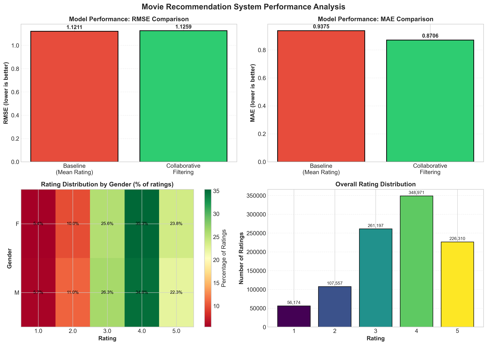

# New Machine Learning Model Creates Personalized Movie Recommendations Based On User Reviews

## What if your streaming service actually understood your tastes, instead of just showing you what's popular?
A new recommendation engine developed by University of Virginia data science researchers can now predict which movies you'll enjoy with better accuracy than popularity-based suggestions.

## Problem Statement
Streaming services offer thousands of movies, but their recommendation engines have fundamental flaws. Popularity-based systems push the same hit movies to everyone, oftentimes ignoring individual preferences. When a viewer's unique taste doesn't align with mainstream hits, they waste time scrolling through irrelevant suggestions deciding what to watch.

Current recommendation approaches rely on simple metrics like "Top 10 in your country" or basic genre matching, which fail to capture nuanced patterns in viewer preferences. This project aimed to answer one question: Can we predict which movies a user will enjoy based on people with similar taste, using only their past ratings? This ability would give viewers personalized recommendations that improve as they rate more content, without requiring platform-specific viewing history.

## Solution Description
We developed a collaborative filtering recommendation system that analyzes over 1 million movie ratings from 6,000 movie fans to predict personalized preferences. The model works by finding users with similar rating patterns, or "taste" in movies, and recommending movies those users loved that you haven't seen yet. The system processes data from the MovieLens dataset, transforming user rating histories into unique profiles. When a user rates movies, the system:
1. Compares their taste to 6,000 other users
2. Identifies the 10 most similar users based on rating patterns
3. Aggregates recommendations from those similar users
4. Returns personalized suggestions of movies ranked by predicted enjoyment

Unlike popularity-based systems that recommend the same movies to everyone, MovieMind adapts to each user's unique preferences. A fan of independent dramas receives different recommendations than someone who prefers action blockbusters, even if both rate popular movies highly.

## Chart

*Figure: Four panel analysis of collaborative filtering model's recommendation performance. The chart in the top left corner compares the root mean squared error of a baseline (mean) predictor and that of the model. The chart in the top right corner compares the mean absolute error between the two. The bottom left corner shows a heatmap of rating distribution based on gender, and the chart in the bottom right shows the overall distribution of movie ratings.*